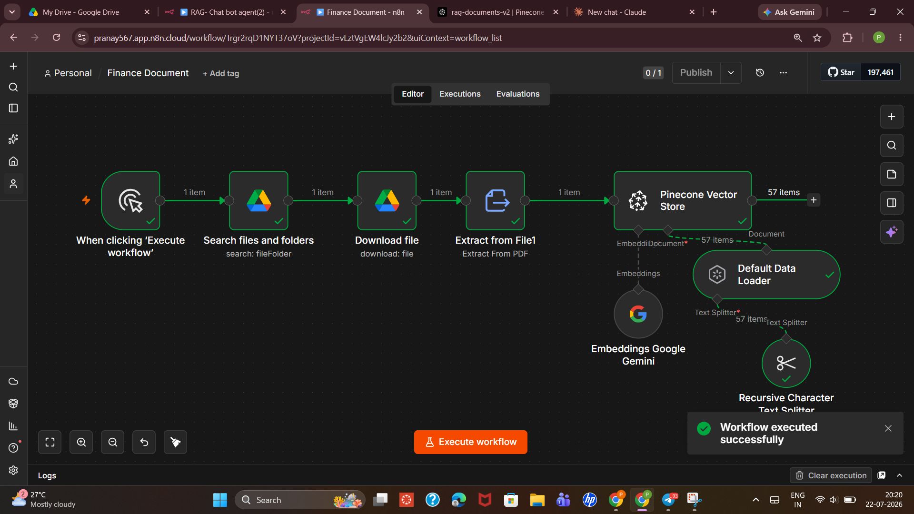
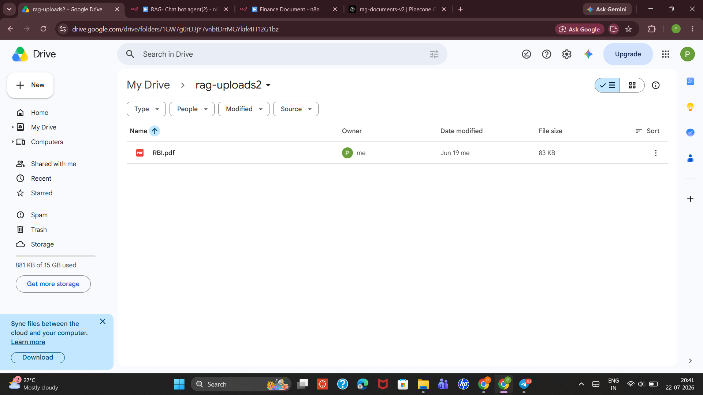
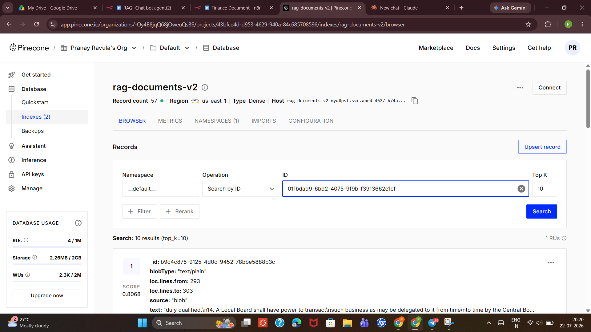
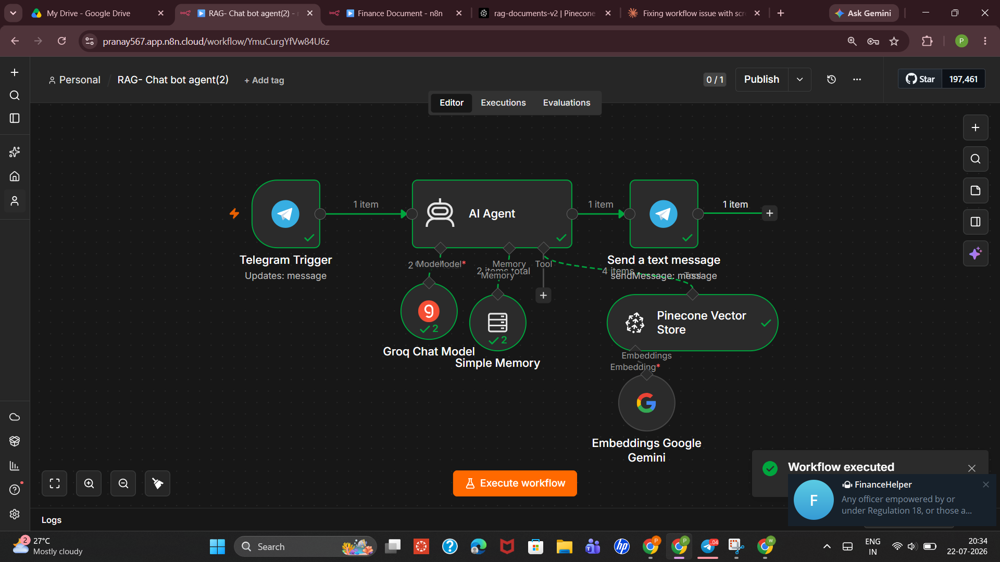
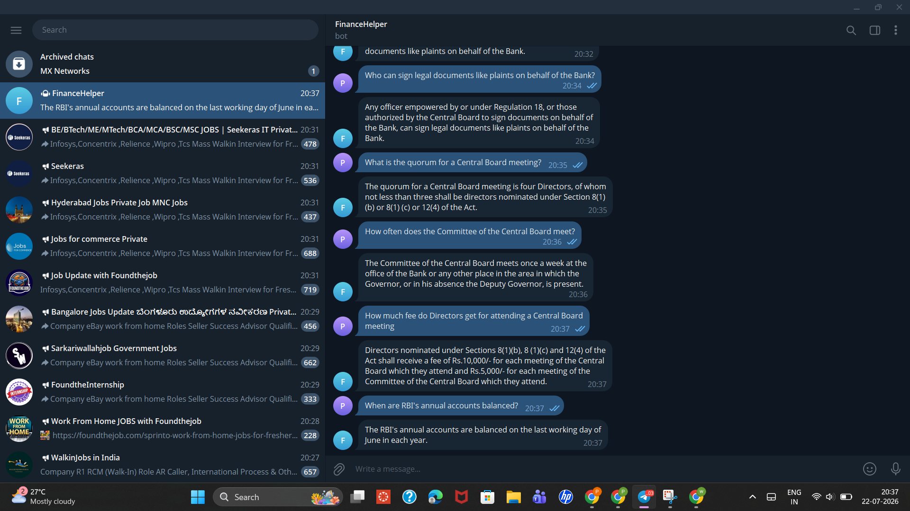

# Finance RAG Agent

A retrieval-augmented chatbot that answers questions about RBI (Reserve Bank of India) regulatory and governance documents — accessible via Telegram, grounded strictly in the source PDF, with no hallucinated answers.

Same core RAG pattern as my [personal-rag-agent](https://github.com/RavulaPranay/personal-rag-agent) project, applied to a denser, more technical document domain: financial/regulatory text instead of a resume, where factual precision matters far more (answers involve legal authority, fee amounts, quorum rules, etc.).

---

## The Problem

Regulatory and governance documents (like RBI's official rules on board meetings, fee structures, and signing authority) are long, dense, and hard to search manually. Asking a general-purpose LLM about specific clauses risks confident-sounding but incorrect answers, since the model has no access to the actual document text and may blend in outdated or unrelated general knowledge.

## The Solution

The source PDF is chunked, embedded, and indexed into a vector database. A chat agent answers questions by retrieving the most relevant chunks first, then answering strictly from that retrieved content — refusing to answer, rather than guessing, when the document doesn't cover the question.

---

## Architecture

Two workflows, built in [n8n](https://n8n.io):

### Workflow 1 — Document Ingestion (`Finance Document`)

```
Manual Trigger
   → Search files and folders (Google Drive)
   → Download file
   → Extract from File (PDF)
   → Pinecone Vector Store (Insert)
        ├─ Recursive Character Text Splitter
        ├─ Default Data Loader
        └─ Embeddings: Google Gemini
```

Ingests `RBI.pdf` from a watched Google Drive folder, producing 57 indexed chunks in Pinecone.

### Workflow 2 — Chat Agent (`RAG - Chat bot agent`)

```
Telegram Trigger (on message)
   → AI Agent (Groq Chat Model)
        ├─ Memory: Simple Memory (multi-turn context)
        └─ Tool: Pinecone Vector Store (Retrieve)
             └─ Embeddings: Google Gemini (same model as Workflow 1)
   → Send a text message (Telegram reply)
```

Every question sent to the Telegram bot triggers a retrieval-then-answer cycle, with the response sent straight back to the same chat.

---

## System Prompt

```
You are a personal knowledge assistant. Answer questions using only the information retrieved from your knowledge tool. If the retrieved content doesn't contain the answer, say "I don't have that information in my documents" rather than guessing or using outside knowledge. Keep answers clear and concise. Do not make up facts, numbers, or details that aren't in the retrieved content.
```

This is intentionally strict for a finance/regulatory use case — an "I don't know" is far safer than a fabricated fee amount or an invented quorum rule. Full prompt and notes in [`docs/system-prompt.md`](docs/system-prompt.md).

---

## Tech Stack

| Component | Tool |
|---|---|
| Orchestration | [n8n](https://n8n.io) (Cloud) |
| Vector database | [Pinecone](https://pinecone.io) (dense index, AWS us-east-1) |
| LLM (agent reasoning) | Groq |
| Embeddings | Google Gemini |
| Memory | n8n Simple Memory (multi-turn session context) |
| Source document | RBI regulatory PDF, via Google Drive |
| Chat interface | Telegram Bot API |

---

## Demo

**Workflow 1 — Document ingestion (57 chunks indexed):**



**Source document in Google Drive:**



**Pinecone index after ingestion:**



**Workflow 2 — Chat agent architecture:**



**Live conversation over Telegram — multi-turn Q&A grounded in the source document:**



Sample exchange from the conversation above:
- *"Who can sign legal documents like plaints on behalf of the Bank?"* → correctly cites Regulation 18 and Central Board authorization
- *"What is the quorum for a Central Board meeting?"* → correctly cites four Directors, referencing specific sub-sections (8(1)(b), 8(1)(c), 12(4))
- *"How much fee do Directors get for attending a Central Board meeting?"* → correctly returns exact figures (Rs. 10,000 and Rs. 5,000) with the distinction between Central Board and Committee meetings

These answers require precise, verbatim retrieval — a general-purpose LLM without document grounding would not reliably produce the correct rupee figures or section references.

---

## What I'd Improve Next

- **Source/section citations** — answers are accurate but don't currently point to the specific clause/page they came from; adding this would make responses auditable against the original PDF
- **Multi-document support** — currently a single regulatory PDF; supporting multiple documents would need namespace or metadata filtering in Pinecone to prevent cross-document mixing
- **Confidence thresholding** — no explicit handling for low-similarity retrieval matches; the agent should flag uncertain matches rather than answering with full confidence
- **Refusal testing** — the "I don't have that information" fallback path needs a dedicated test set of out-of-scope questions to confirm it reliably declines rather than drifts into general knowledge

---

## Repo Structure

```
finance-rag-agent/
├── README.md
├── workflows/
│   ├── workflow-1-document-ingestion.json
│   └── workflow-2-chat-agent.json
├── screenshots/
│   ├── workflow-1-document-ingestion.png
│   ├── google-drive-source-document.png
│   ├── pinecone-index-browser.png
│   ├── workflow-2-chat-agent.png
│   └── telegram-conversation-example.png
└── docs/
    └── system-prompt.md
```

---

## Author

**Ravula Pranay** — [GitHub](https://github.com/RavulaPranay) · [LinkedIn](http://www.linkedin.com/in/pranay-ravula-03131a270)
